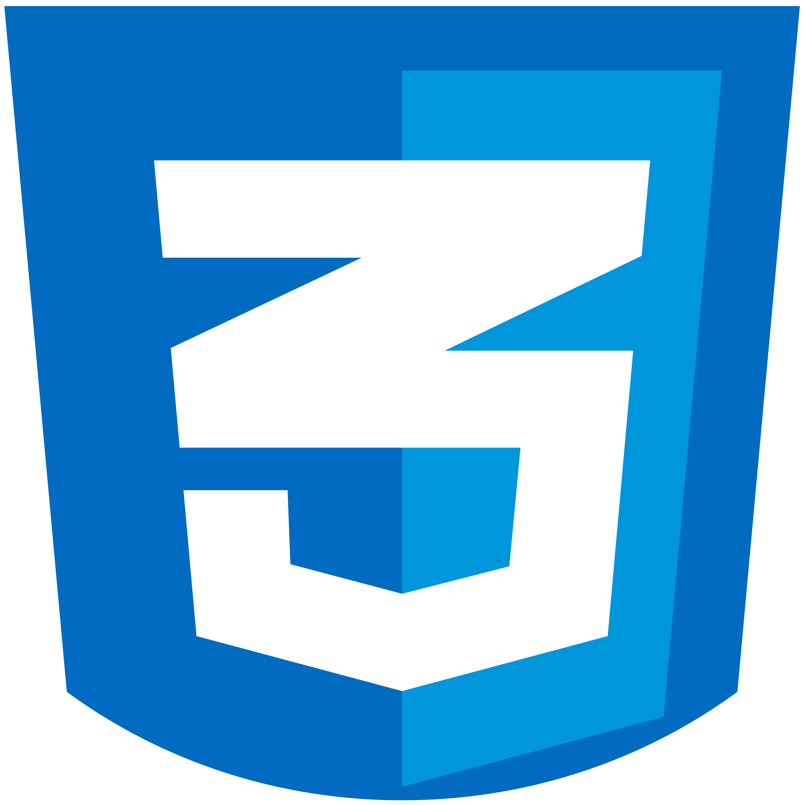
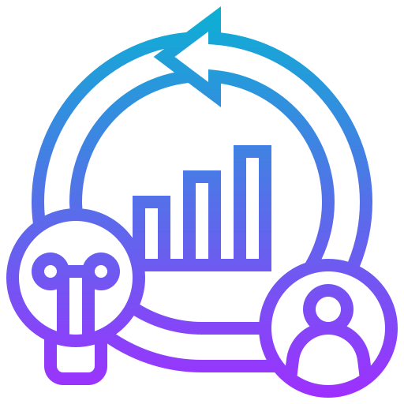
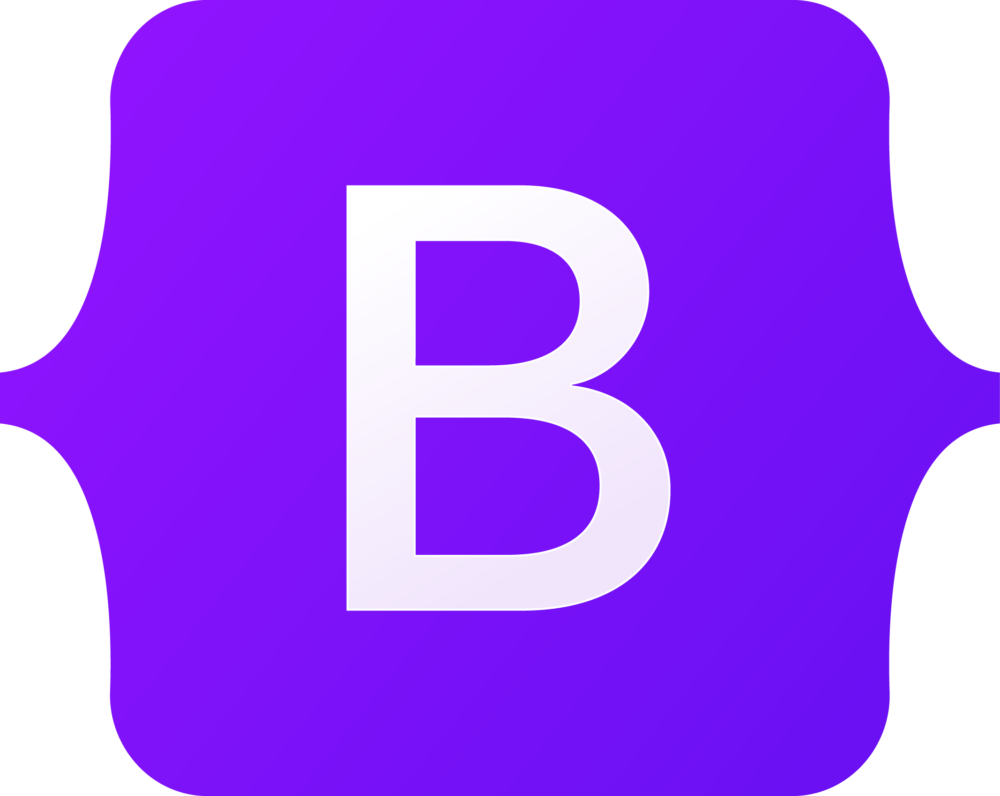
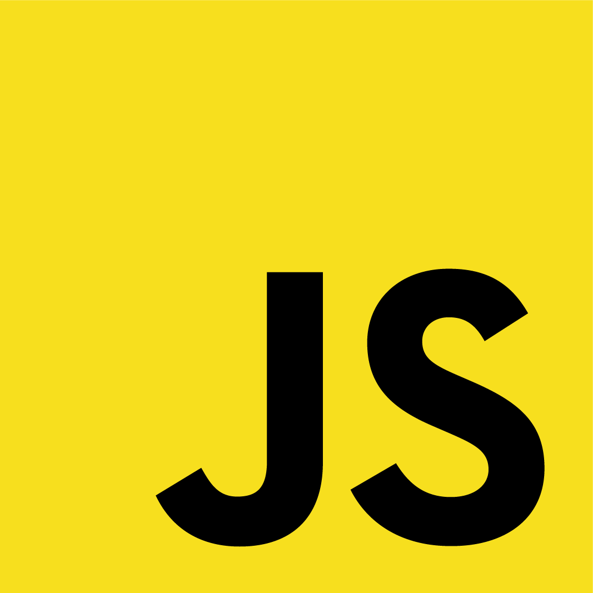
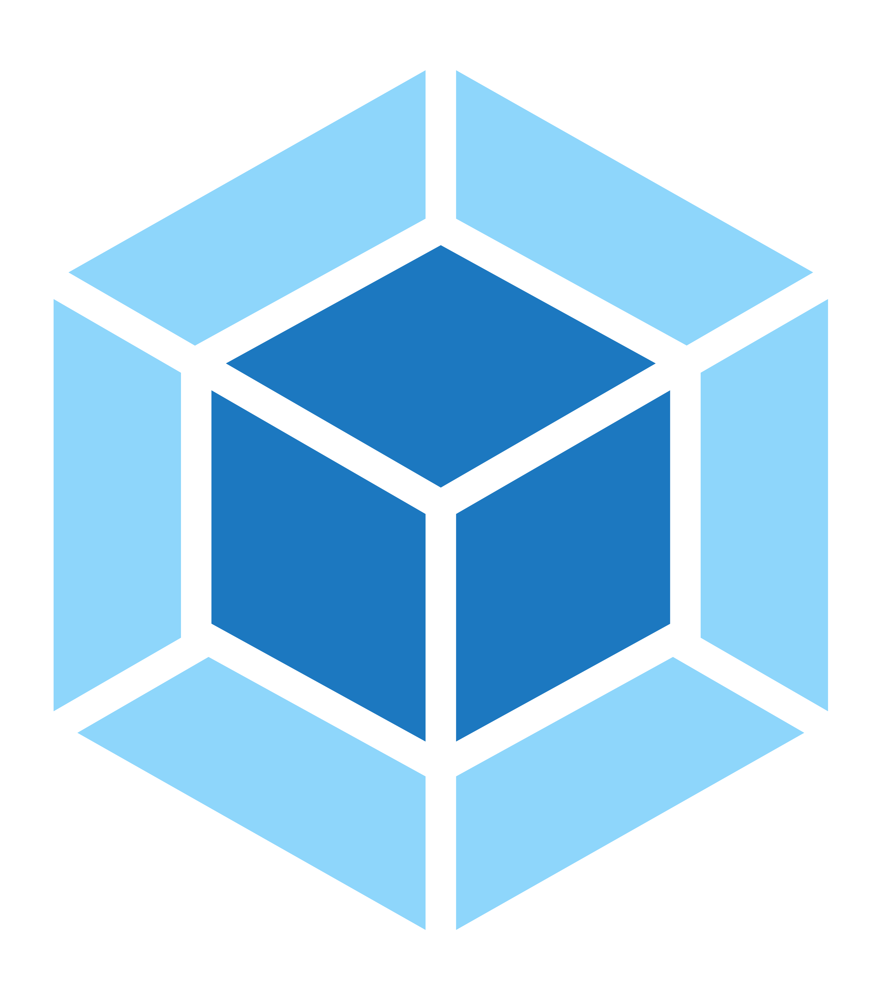
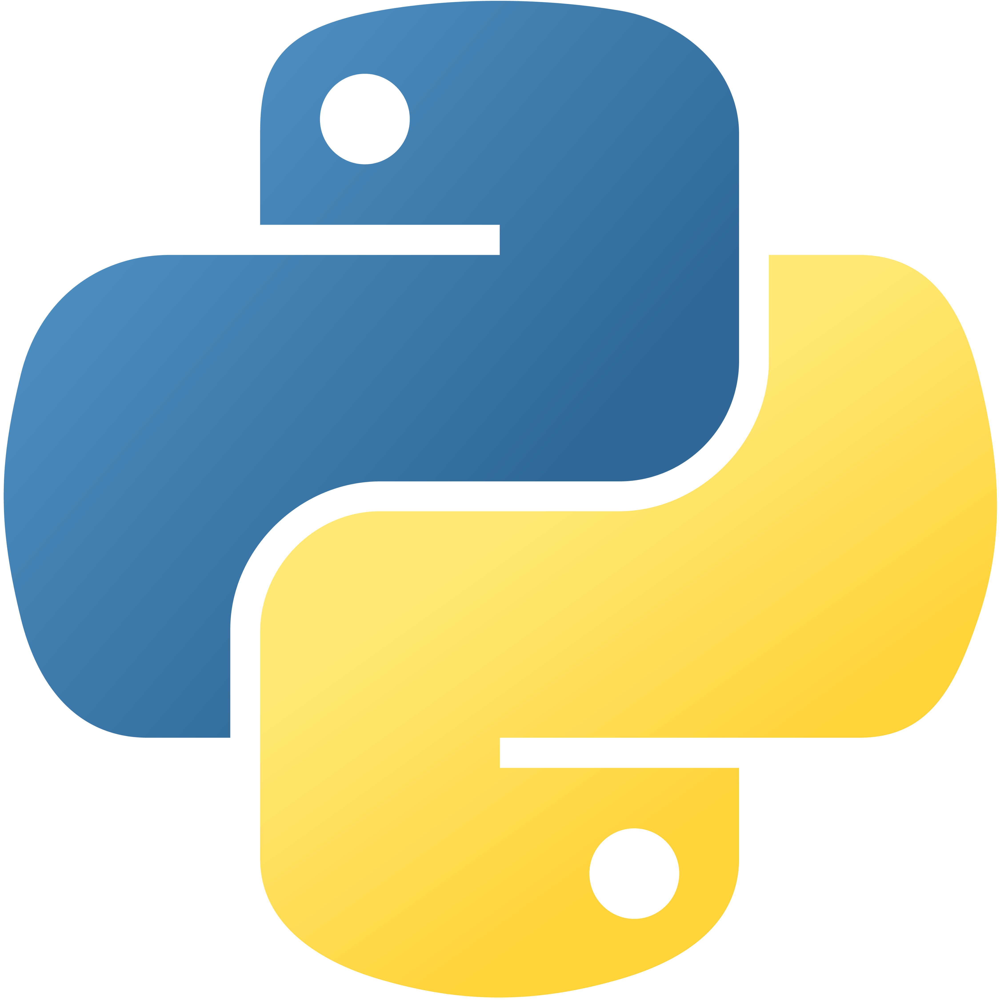
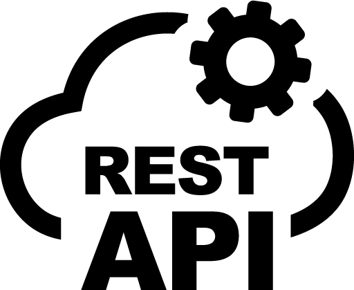
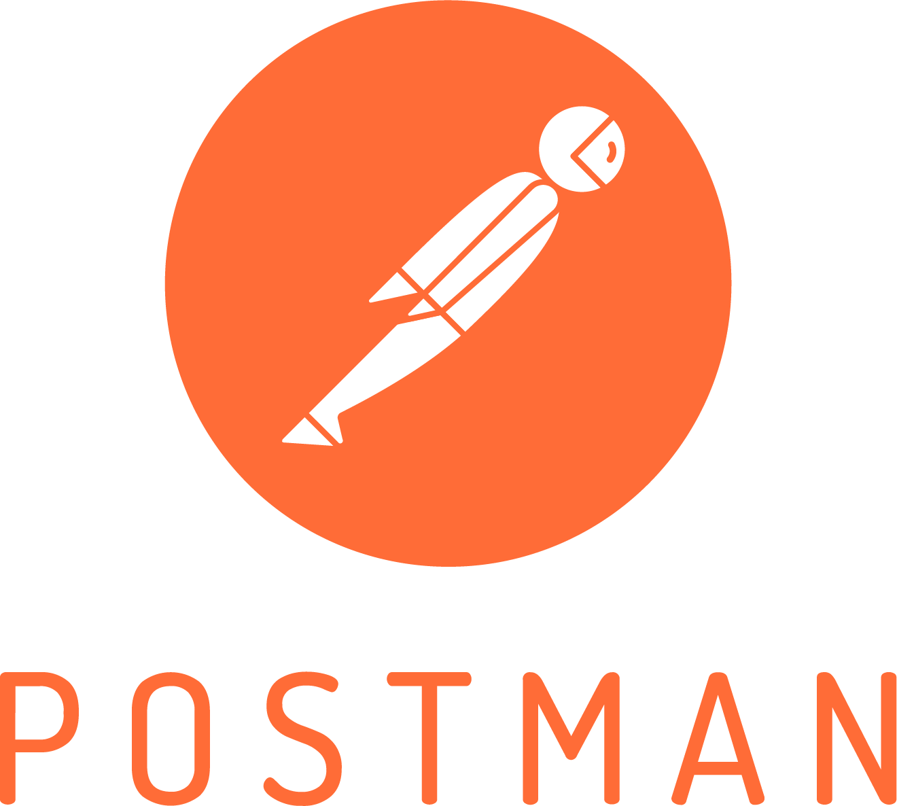

### Hola 👋, Soy Richard Jardine
#### Bienvenido! 

En este espacio podrás conocer mis proyectos en desarrollo de software y otras áraes de tecnología

Soy un profesional responsable, curioso del conocimiento, proactivo y multidisciplinar. 

<!-- Habilidades: Java Script / React / Python / HTML / CSS / Flask / SQL / WEBPACK / AGILE COACHING / SCRUM / KANBAN /  -->

- 🔭 Actualmente estoy trabajando en la segunda fase del proyecto Web App AcompañaME (Proyecto Final presentado en 4Geeks Academy Venezuela) 
- 🌱 Soy una persona que mle gusta aprender y superarse a si mismo contantemente, por lo que me encuentro aprendiendo acerca de los siguiemntes temas y áreas del conocimiento: AI Aprendizaje Automatico + Algoritmos + Estructuras de Datos + Liderazgo Consciente + Mindset + IOT 

        

<!-- # Hi everyone 👋🌵
> I'm Bryan Garcia, a Fullstack web developer with a mainly in love for Frontend development.

- Open to work
- 👨‍💻 I'm currently working as a Teacher Assistant at <a href="https://www.linkedin.com/school/4geeksacademy/mycompany/">4Geeks Academy</a> 
- If you want to contact me: <a href="https://www.linkedin.com/in/bryan-garcia-fullstack/"> Linkedin</a>
- 📍 Based on Lima, Perú.  -->
 
### ***I love the challenges, so if you have one, don't doubt to contact me ❤.***

## Skills and Tools ⚙🔨

#### **Front end**

|  HTML  |  CSS  | Bootstrap  |  JavaScript  |  React  |  Node.js |  Webpack  |
|:---:|:---:|:---:|:---:|:---:|:---:|:---:|:---:|
|   |   |    |    |    |    |    |    |
 

#### **Back end**
|  Python  |  Flask  |  PostgreSQL  |  SQL  |  SQL Alchemy  |  REST API  |  Flux  |  Webpack  |
|:---:|:---:|:---:|:---:|:---:|:---:|:---:|:---:|
|   |   |    |    |    |    |    |    |
 

#### **Tools and Competencies**
| Jira |  AI  |  VS Code  |  Postman  |  Git  |  Agile  |  Scrum  |  Kanban  | Trello  |  Figma  | Digital Transformation | Services Management |
|:---:|:---:|:---:|:---:|:---:|:---:|
|   |   |    |    |    |  |     |

<!--  -->
